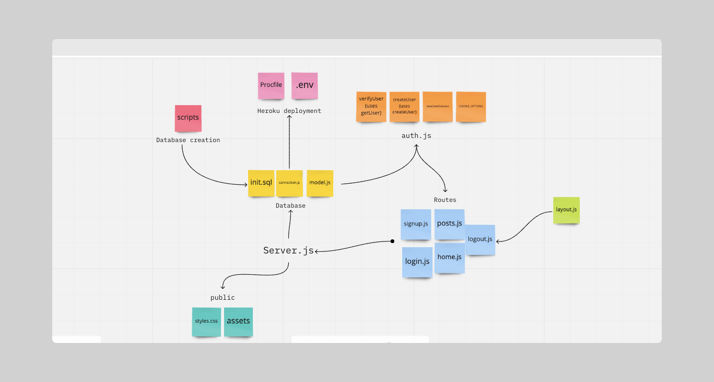

# POST IT BOARD 📮

An app hosting your post it notes! 📌

[`Deployed version here`](https://post-post-its.herokuapp.com/)

### Instructions for how to run locally

1. Clone the repo
2. cd into the folder and run `NPM install`
3. Run the scripts > create_db and populate_db to initialise the local copy of the database

### Core User Stories 📖

As a user 🙎‍♀️ I want to...

- Post my post-it note to the board
- Come back later and see that my post-it is still there
- Delete my post-it
- See everybody's post-its

### Acceptance Criteria ✅

✔️ Forms for users to sign up and log in

✔️ A form for users to submit post-its only accessible to logged in users

✔️ A page showing all the post-its

✔️ Semantic form elements with correctly associated labels

✔️ A Postgres database hosted on Heroku

✔️ Hidden environment variables

Future improvements 🕰

- Layout file for all pages generated on the server
- Static CSS files
- Tests 🧪 for all routes
- A user page that shows all post-its posted by that user
- GitHub Actions CI setup to run tests when we push

### Database schema

### What we learnt 📚

- How to delopy an app with a Postgres database hosted on Heroku
- How to implement a sign-up and log-in page
- How to use cookie based sessions 🍪
- How to salt and hash passwords
- How to allow a user to delete only their post-its
- How to debug async code ⌚️
- How to debug using Heroku logs

### Bugs we ran into 🐛

- We had an issue connecting to Heroku hosted Postgres db - solved with setting SSL option to allow unauthorised access in connection.js

`ssl: { rejectUnauthorized: false }`

- Race conditions causing page to redirect before post was deleted - fixed by refactoring the promise containing the model.deletePost to an arrow function (explicit return)

  `model .getSession(sid) .then((session) => model.deletePost(postId, session.user.id)) .then(() => response.redirect('/posts'));`
